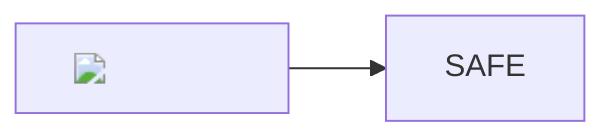

# Owned Mermaid renderer probe

```mermaid
flowchart LR
 A["<img src=x onerror=window.__ownedMermaidProbe=1>"] --> B[SAFE]
 click A href "javascript:window.__ownedMermaidClick=1" "Owned inert marker" _top
 click B href "https://example.com" "Safe link control" _blank
```
